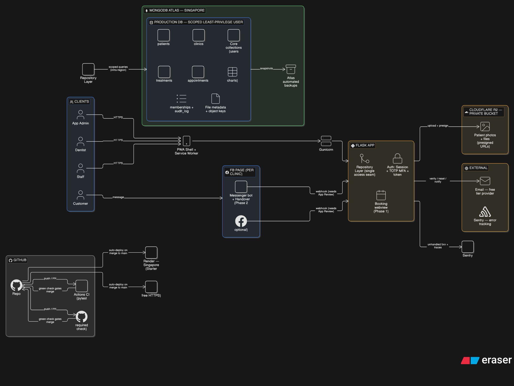

# 🦷 MyDentalPortal

[](https://github.com/jaspherramos98/MyDentalPortal/actions/workflows/ci.yml)

A web-based **dental clinic management system** built for a real clinic
(JRAMOS DENTAL HUB — Obando, Bulacan, Philippines). It runs a single clinic today but is
architected for multi-clinic, multi-staff (role-based) growth.

> ⚕️ **This is production medical software handling patient health data (PHI).** Confidentiality,
> integrity, and access control are first-class concerns in every change.

---

## 🎯 Goal Architecture

The target production architecture — Render (Singapore region, co-located with the database),
MongoDB Atlas for data, Cloudflare R2 for file storage, and a phased customer-intake flow through
each clinic's Facebook Page:



> 📌 The diagram is the **goal** state. See **[Status: now vs. goal](#-status-now-vs-goal)** below for
> what's live today versus what's on the roadmap. An earlier snapshot of the pre-production setup is
> in [`Architecture_before_prod.png`](Architecture_before_prod.png).

---

## 🧰 Tech Stack

| Layer        | Technology |
|--------------|------------|
| **Backend**  | Python 3.11, Flask, Flask-PyMongo |
| **Database** | MongoDB (MongoDB Atlas in production) + GridFS for files |
| **Frontend** | Jinja2, Bootstrap 5, Font Awesome, vanilla JS, installable **PWA** |
| **Hosting**  | Render (HTTPS auto-provisioned) |
| **CI**       | GitHub Actions (pytest, hermetic — mongomock, no live DB) |
| **Testing**  | pytest + mongomock; stdlib HTTP smoke test; Vegeta load harness |

---

## ✨ Features

### ✅ Built today
- **Patient records** — full PDA-style intake (personal, contact, medical & dental history,
  allergies, insurance, minor/guardian info), pagination, soft-delete.
- **Dental chart** — FDI (ISO 3950) numbering with the cross-quadrant layout used in the Philippines
  (permanent + deciduous teeth), condition codes, and assessment sections (periodontal, occlusion,
  appliances, TMD, X-ray).
- **Treatments** — billing-aware records (charged / paid / balance), per-clinic currency (₱ / $).
- **Appointments** — calendar with day/week/month views, drag-and-drop scheduling, overlap checks;
  mobile-friendly swipeable layout.
- **Files & photos** — patient photos, document attachments, and prescriptions stored in GridFS with
  upload validation (extension + magic-byte + image decode) and forced-download hardening.
- **Reports** — revenue, collections, top procedures, and patient-growth analytics per clinic.
- **Multi-clinic** — clinics owned and managed per user.
- **Auth & access control** — session login with rate limiting + CSRF, an admin **approval gate** for
  registration, and an account **lifecycle gate** (approved + active only).
- **Architecture** — slim app factory + blueprints, a **repository layer** as the single data-access
  seam, pydantic schema validation at the write boundary, and an installable online-first **PWA**.

### 🚧 Being added (roadmap)
Ordered by dependency — each step de-risks the next (full detail in [`TODO.md`](TODO.md)):

1. **Required CI check** — branch protection so a red test suite blocks merges.
2. **Ops safety net** — off-box **error tracking (Sentry)** + a tested **backup & restore drill**
   *before* the big feature work begins.
3. **Multi-staff clinic membership + roles** — `memberships` collection (owner → membership-based
   access), App Admin / Dentist / Staff roles, a permission matrix, staff access codes, and a
   DB-backed **audit log**.
4. **TOTP MFA** — authenticator-app two-factor login for all PHI-accessing accounts (no SMS/email
   dependency).
5. **Customer-facing booking via Facebook Page** *(phased)* —
   **Phase 1:** the Page's native "Book Now" button → an in-app booking webview (pick an available
   slot, enter details) → a pending appointment the dentist accepts/declines → auto-added to the
   calendar. *(No Meta API required.)*
   **Phase 2 (optional):** a full Messenger Platform bot with the Handover Protocol.
6. **Email infrastructure** (free tier) → **email verification** + self-service **password reset**.
7. **Production hardening** — migrate Render to its **Singapore region**, upgrade to a no-spin-down
   plan, PWA install/Lighthouse verification.
8. **Triggered:** move file storage from GridFS → **Cloudflare R2** (private presigned URLs) when
   database storage / memory / backup pressure warrants it.

---

## 📊 Status: now vs. goal

| Component | Today | Goal |
|-----------|-------|------|
| Hosting | Render (free tier) | Render **Singapore**, no spin-down |
| Database | MongoDB Atlas (Singapore) | unchanged |
| File storage | **GridFS** (in MongoDB) | **Cloudflare R2** (triggered) |
| Auth | Session + approval/lifecycle gates | + **TOTP MFA**, token auth |
| Access model | Owner-scoped (single seam) | **Membership + roles + audit log** |
| Customer intake | — | **FB Page → booking webview** |
| Observability | Render logs | **Sentry** error tracking |

---

## 🚀 Local Development

```bash
# 1. Virtual environment
python -m venv venv
venv\Scripts\activate          # Windows
# source venv/bin/activate     # macOS / Linux

# 2. Dependencies
pip install -r requirements.txt

# 3. Environment
cp .env.example .env           # then edit MONGO_URI, SECRET_KEY, etc.

# 4. Run (requires a local MongoDB)
python app.py                  # http://localhost:5000
```

## ✅ Testing

```bash
pip install -r requirements-dev.txt   # pytest + mongomock
pytest                                # hermetic — no DB/network needed

# HTTP smoke test against a running local instance (refuses prod):
BASE_URL=http://127.0.0.1:5000 python scripts/smoke_test.py
```

## 🌐 Deployment

Deployed on **Render**, which auto-provisions HTTPS. Production data lives in **MongoDB Atlas**, with
per-database least-privilege users and automated backups. Configuration is supplied via environment
variables (never committed). See [`render.yaml`](render.yaml) and [`CLAUDE.md`](CLAUDE.md) for details.

---

## 📄 License & Use

Private project for a working dental clinic. Not licensed for redistribution.
